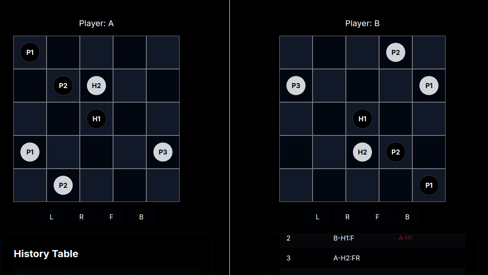

# Turn-Based Chess-like Game with Websocket Communication
## Overview
This repository contains a turn-based chess-like game implemented with a server-client architecture using Websockets for real-time communication.
The game is played on a 5x5 grid and features three types of characters: Pawns, Hero1, 
and Hero2, each with specific movement and attack patterns. 
The objective is to eliminate all of the opponent's characters.

## Demo 


## Project Structure
- [Server](https://github.com/Sarath191181208/VangipuramSrinivasaSarathChandra_21BCE9853/tree/master/client): Handles communication with clients via Websockets.
- [Web Client](https://github.com/Sarath191181208/VangipuramSrinivasaSarathChandra_21BCE9853/tree/master/server): Provides a web-based user interface to interact with the game, display the game board, and handle user inputs.
- [Game](https://github.com/Sarath191181208/VangipuramSrinivasaSarathChandra_21BCE9853/tree/master/game) : Handles all the things related to game logic, game state etc.


# Turn-Based Chess-like Game with Websocket Communication


## Overview

### Setting Up the Server

1. Navigate to the `server` directory:
    ```bash
    cd server
    ```

2. Install server dependencies:
    ```bash
    npm i
    ```

3. Build and start the server:
    ```bash
    npm run build
    npm start
    ```

### Setting up the client 
1. Navigate to the `client` directory:
    ```bash
    cd client
    ```

2. Install server dependencies:
    ```bash
    npm i
    ```

3. Build and start the server:
    ```bash
    npm run dev
    ```

### Events Handled

1. **Game Initialization**: Sets up the game board and starts a new game.
2. **Player Move**: Processes player moves and updates the game state.
3. **Game State Update**: Broadcasts the updated game state to all clients.
4. **Invalid Move Notification**: Notifies the player if their move was invalid.
5. **Game Over Notification**: Announces the end of the game and the winner.

## Implementation Details

### Server Implementation

- **Game Logic**: Implemented using TypeScript in the `server` directory. The logic includes handling player moves, validating moves, and updating the game state.
- **Express Server**: Handles HTTP requests and serves the client-side application.
- **Socket.io**: Manages real-time communication between the server and clients.

### Web Client Implementation

- **React**: Used for building the user interface in the `client` directory.
- **TypeScript**: Ensures type safety and robust code in both client and server.
- **Tailwind CSS**: Provides a utility-first CSS framework for styling the web interface.

### Handling Edge Cases

- **Simultaneous Moves**: Managed by ensuring that only one player can make a move at a time.
- **Disconnections**: Clients can reconnect, and their previous state is restored.
- **Invalid Actions**: Moves are validated on both client-side and server-side to prevent illegal actions.

## Bonus challanges
-[ ] **Hero3**: Added a new character type with complex movement patterns.
-[ ] **Dynamic Team Composition**: Players can choose their team composition at the start of each game.
-[x] **Spectator Mode**: Implemented for observing ongoing games.
-[ ]**Chat Feature**: Added for player communication.
-[ ] **AI Opponent**: Implemented a basic AI for single-player mode.
-[ ]- **Replay System**: Allows players to review past games.

## Code Quality 

### Single Responsibility Principle
Each function and module in the project adheres to the single responsibility principle. This means that each function or class is designed to perform one specific task. For example:
- Services contain the core logic for game mechanics and state management, separate from request handling.
- Utils provide helper functions that are used across different modules, avoiding code duplication.
This modular approach ensures that the codebase remains clean, maintainable, and scalable.

### Server-Side Error Handling
- Error Propagation: Functions return error values along with results, allowing callers to handle errors explicitly. This pattern reduces hidden errors and ensures that all errors are addressed at appropriate levels.
- Detailed Logging: Errors are logged with detailed information, including stack traces and contextual data, making it easier to diagnose and fix issues.
- Validation: Input validation is performed at the controller level before passing data to the services. This ensures that invalid data does not propagate through the application.
